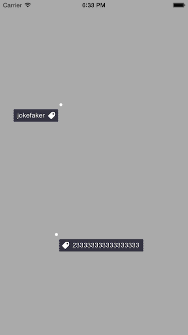

# ImageTipLabel
A control to help us put labels in photo,like in and nice.

## Screen Shot


## Usage
1. Call configTipLabelWithBackgroundImage: to config your label's background image.
2. Call TipLabelWithText: tipImage: direction: editModel: to create a instance.
	* If you want a new label with different background image,you can call TipLabelWithText: tipImage: backgroundImage: direction: editModel:,it will not break the common setting of the background.
	* If you set editModel to NO,the label's gestures like drag,long press and tap will be disabled.
	* Do not forget to make your background image can be resized in a correct way to adapt the different width of the label.
3. Call addTipLabelToView: tipX: tipY:
	* The first parameter is the view to add to,it can be a UIImageView for example.
	* tipX and tipY is something like this : tipX = whitePoint.center.x/originImage.size.width,it is designed to adapt differenet width/height.
4. Here is a complete example:

```
    // config the background for once
    [ImageTipLabel configTipLabelWithBackgroundImage:[UIImage imageNamed:@"tip_text_bg"]];
    
    // after config the background, you just need to call TipLabelWithText: tipImage: direction: editModel: if you do not want to get a label with different background
    ImageTipLabel *label1 = [ImageTipLabel TipLabelWithText:@"jokefaker" tipImage:[UIImage imageNamed:@"tip_type_label"] direction:ImageTipLabelDirectionLeft editModel:YES];
    [label1 addTipLabelToView:self.view tipX:0.3123 tipY:0.3];
    
    // set editModel to no to disable dragging and other gestures
    ImageTipLabel *label2 = [ImageTipLabel TipLabelWithText:@"233333333333333333" tipImage:[UIImage imageNamed:@"tip_type_label"] direction:ImageTipLabelDirectionRight editModel:NO];
    [label2 addTipLabelToView:self.view tipX:0.3 tipY:0.7];
    
    NSLog(@"%f %f", label1.tipX, label1.tipY);
    NSLog(@"%f %f", label2.tipX, label2.tipY);
```

## Requirement
ARC && iOS 7

##Features

- [x] drag
- [x] long press to delete
- [x] tap to change direction
- [x] input/output the scale in superview 
- [x] custom tip image and background
- [ ] contentview inset
- [ ] little white point's animation